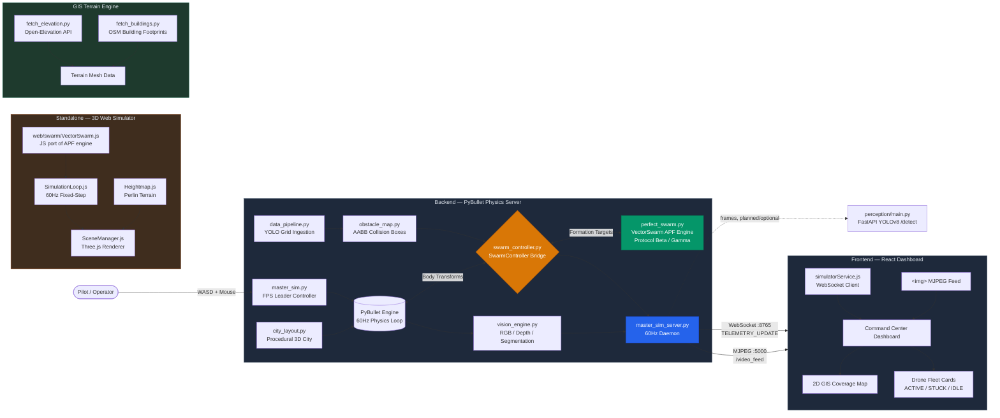

<div align="center">

# DroneSwampMapping

**A unified drone-swarm simulation platform: real PyBullet physics, a zero-install browser preview, and one shared swarm-intelligence engine driving both.**

[](https://www.python.org/)
[](https://nodejs.org/)
[](https://react.dev/)
[](https://pybullet.org/)
[]()

[Overview](#overview) • [Architecture](#architecture) • [Quickstart](#quickstart) • [Repository Layout](#repository-layout) • [Formation Protocols](#formation-protocols) • [Branch Strategy](#branch-strategy) • [Roadmap](#roadmap) • [Contributing](#contributing)

</div>

---

## Overview

DroneSwampMapping is a swarm-robotics simulation project built around one
core idea: **one physics/swarm-intelligence engine, two ways to view it.**

- **PyBullet showcase** (`backend/`) — real rigid-body physics, a
  procedurally generated 3D city, FPS-style piloting of a lead drone, and
  an onboard RGB/depth/segmentation vision pipeline. This is the
  high-fidelity reference simulation.
- **Browser preview** (`web/`) — a lightweight, dependency-free Three.js
  simulation that runs the *same* Artificial Potential Fields (APF) swarm
  algorithm, verified byte-for-byte against the Python reference via
  fixture tests. No install required — open `web/index.html` and it runs.
- **React control app** (`frontend/`) — a live dashboard consuming real
  WebSocket telemetry from the PyBullet backend: per-drone stats, a
  coverage map, and a live camera POV feed with perception overlays.
- **GIS terrain engine** (`geo_terrain/`) — fetches real-world elevation
  data and building footprints for terrain mesh generation from GPS
  coordinates.

Both simulation surfaces are driven by the same swarm-physics core
(`VectorSwarm` — an Artificial Potential Fields engine with attraction,
inter-drone separation, obstacle repulsion, and stuck/escape-noise
recovery), implemented in parallel in Python and JavaScript and kept in
sync with cross-language fixture tests, not just "looks similar."

> **Project status:** the PyBullet backend, browser preview, and React
> frontend are wired together on real, live data — not mocked. Formation
> protocols (linear sweep, dynamic encirclement) work in both simulation
> surfaces. See [Roadmap](#roadmap) for what's still in progress.

---

## Architecture



**Note:** The standalone `web/` Three.js simulator uses its own JS port of the APF engine and does not currently connect to the PyBullet backend's WebSocket/MJPEG streams — it's a separate, self-contained sandbox environment.

### Canonical data contracts

Every module that produces or consumes drone/world state uses the same
shape, defined once in Python and once in JavaScript and kept in sync:

**`DroneState`** (`backend/schemas/drone_state.py`, `shared/schemas/droneState.js`)
```json
{
  "id": "0",
  "position": { "x": 0.0, "y": 0.0, "z": 0.0 },
  "velocity": { "x": 0.0, "y": 0.0, "z": 0.0 },
  "heading": 0.0,
  "battery": 1.0,
  "status": "ACTIVE"
}
```
`status` is one of `ACTIVE | IDLE | STUCK | OFFLINE`. A drone is marked
`STUCK` only when it is both moving slowly **and** meaningfully far from
its current target, sustained for a short debounce window — a single
velocity check isn't enough to distinguish "stuck" from "correctly
decelerating on arrival."

**Hazard/terrain grid**
```json
{ "grid": [[0, 1, 0, ...], ...], "cellSize": 10 }
```

**Perception detection**
```json
[{ "class": "obstacle", "bbox": [x, y, w, h], "confidence": 0.87 }]
```

---

## Quickstart

### 1. Browser preview (no install, no backend needed)

```bash
# from the repo root
open web/index.html
# or serve it locally, e.g.:
python -m http.server 8000 --directory web
```

This runs the full APF swarm simulation client-side. Use the scenario
selector to switch between preset environments (open field, dense
obstacles, search-and-rescue formation, etc.) and formation protocols.

### 2. PyBullet backend + React dashboard

```bash
# Backend
cd backend
pip install -r requirements.txt
python master_sim_server.py
# → WebSocket telemetry on ws://localhost:8765
# → MJPEG camera stream on http://localhost:5000/video_feed

# Frontend (separate terminal)
cd frontend
npm install
npm run dev
# → opens the live dashboard, connects to the backend automatically
```

### 3. (Optional) YOLOv8 perception service, for the browser preview's live detection overlay

```bash
cd perception
docker build -t droneswarm-perception .
docker run -p 8001:8001 droneswarm-perception
```

The browser preview's perception client (`web/perception/`) polls this
service for object detections on the active drone's POV frame.

---

## Repository Layout

```
DroneSwampMapping/
├── backend/                  PyBullet showcase simulation
│   ├── master_sim.py           Standalone local entry point (GUI window)
│   ├── master_sim_server.py    Headless server: WS telemetry + MJPEG stream
│   ├── swarm_controller.py     Bridges PyBullet rigid bodies ↔ VectorSwarm
│   ├── perfect_swarm.py        VectorSwarm APF engine + formation generators
│   ├── obstacle_map.py         Builds 3D AABB obstacle volumes from city geometry
│   ├── data_pipeline.py        YOLO detection → hazard grid ingestion
│   ├── city_layout.py          Procedural city generation (Kenney asset kits)
│   ├── vision_engine.py        RGB/depth/segmentation camera rendering
│   ├── test_client.py          Mock WebSocket client for integration testing
│   ├── schemas/                Canonical DroneState (Python)
│   └── tests/                  Formation mode tests
│
├── frontend/                  React dashboard (Vite)
│   └── src/
│       ├── contexts/             SimulationContext (WS), DroneContext, MissionContext
│       ├── components/           TopBar, Sidebar, DroneCard, CoverageMap, MiniChart,
│       │                         MissionLog, CommandCenter, BottomStats, ...
│       ├── pages/                Dashboard (main view)
│       └── services/             simulatorService.js (framework-agnostic WS client)
│
├── web/                       Browser-only Three.js preview (zero install)
│   ├── main.js                  Bootstrap + render loop
│   ├── core/                    Fixed-timestep physics loop, Drone state
│   ├── swarm/                   VectorSwarm.js (JS port) + formation generators
│   ├── render/                  SceneManager, DroneRenderer, TerrainRenderer,
│   │                            DroneCamera, CameraControls
│   ├── data/                    Heightmap generation, preset scenarios
│   ├── ui/                      ControlPanel (scenario/formation/drone-count UI)
│   ├── perception/              YOLOv8 client for the optional detection overlay
│   └── tests/                   Fixture-based swarm parity tests
│
├── perception/                 Dockerized FastAPI + YOLOv8n detection service
│   ├── main.py                  /detect endpoint
│   ├── Dockerfile               Container build
│   └── requirements.txt
│
├── geo_terrain/                GIS terrain engine
│   ├── fetch_elevation.py       Open-Elevation API → heightmap data
│   ├── fetch_buildings.py       OSM Overpass → building footprints
│   ├── prototype_fetch.py       Combined terrain prototype
│   ├── cache/                   Cached elevation, building, and tile data
│   └── PHASE[1-2]_FINDINGS.md  Terrain research findings
│
├── shared/schemas/             Canonical DroneState (JavaScript)
│
├── tests/                      Cross-language fixture & unit tests
│   ├── fixture_snapshot.json      Reference APF output snapshot
│   ├── fixture_protocol_beta_gamma.json
│   ├── generate_fixture*.py       Fixture generators
│   ├── test_vector_swarm.py       APF engine parity tests
│   ├── test_stuck_detection.py    Stuck-state detection tests
│   ├── test_swarm_controller.py   Controller integration tests
│   └── test_perception_endpoint.py
│
├── issue[1-5]-*.md             Team task specifications
├── .gitignore
├── requirements.txt            Root-level Python dependencies
└── README.md
```

---

## Formation Protocols

The swarm supports pluggable formation modes, implemented identically
(fixture-verified) in both `backend/perfect_swarm.py` and
`web/swarm/VectorSwarm.js`:

| Mode | Behavior |
|---|---|
| **Orbit** *(default)* | Followers circle the lead drone at a fixed radius, each at its own angular offset. |
| **Beta** — Linear Sweep | Drones distribute evenly along a line between two points — a search/coverage sweep formation. |
| **Gamma** — Dynamic Encirclement | Drones distribute evenly around a circle at a given radius — a containment/encirclement formation. |

In the PyBullet backend, switch modes live over the WebSocket connection:

```json
{ "type": "SET_FORMATION", "payload": { "mode": "beta", "start_point": [0, 0], "end_point": [100, 0] } }
```

In the browser preview, formations are selected via the scenario
dropdown or by calling `generateProtocolBeta()` / `generateProtocolGamma()`
directly from `web/swarm/VectorSwarm.js`.

All drones use a shared Artificial Potential Fields core regardless of
formation mode: attraction toward the current target, inter-drone
separation, obstacle repulsion (from real 3D geometry in the PyBullet
backend, from precomputed obstacle shapes in the browser preview), and
stuck-detection with escape-noise recovery.

---

## Branch Strategy

The repo uses a **clean two-branch remote** with archived history preserved via tags:

| Remote Branch | Purpose |
|:---|:---|
| `main` | Production-ready, integrated code |
| `legacy-system` | Consolidated archive of 6 historical dev branches (each in its own subfolder) |

### Archive Tags

Original branch tips are permanently preserved as lightweight tags for full commit history access:

| Tag | Original Branch | Description |
|:---|:---|:---|
| `archive/phase0-uncommitted-wip` | `phase0-uncommitted-wip` | Protocol Beta/Gamma WIP, grid bounds fixes |
| `archive/rahul-hazard-integration` | `rahul-hazard-integration` | Telemetry tracking, API compat, test coverage |
| `archive/rahul-simulation-engine` | `rahul-simulation-engine` | WebSocket pipeline mainframe |
| `archive/shreyas` | `shreyas` | Drone 3D model render |
| `archive/sutar` | `sutar` | YOLOv8 perception integration, WebSocket bridge |
| `archive/sutar-recovered-decision-engine` | `sutar-recovered-decision-engine` | A* path planning, hierarchical decision engine |

To inspect any archived branch's full history:
```bash
git log archive/<branch-name>
git checkout -b temp-restore archive/<branch-name>
```

---

## Roadmap

**Done:**
- Canonical `DroneState` schema, unified across backend, frontend, and browser preview
- One APF swarm engine driving both the PyBullet showcase and the browser preview, cross-language fixture-verified
- Dynamic drone count (add/remove live, in both simulation surfaces)
- Formation protocols (orbit, linear sweep, dynamic encirclement) in both surfaces
- Procedural terrain (Perlin-noise heightmap) and preset scenarios in the browser preview
- Real-time React dashboard with live telemetry and camera POV
- GIS terrain engine with real-world elevation and building data fetching
- YOLO detection → hazard grid pipeline integration into the APF repulsion system
- Branch consolidation and archive tagging for clean repo history

**In progress / planned:**
- **Map/environment builder** — construct scenes from real GPS coordinates, Google Earth imports, or live sensor feeds, using a shared structure library
- **Autonomous mission generator** — pathfinding (A*), automatic lead-drone assignment, and formation generation from a target region, with code/visual output. A working A* planner and hierarchical decision engine exist in the archived `sutar-recovered-decision-engine` branch and are being adapted to the current 3D obstacle representation.
- **Hardware compatibility bridge** — sim-first, controller-next: the same mission/command interface that drives the simulation will drive real hardware later
- **3D formation view in the React dashboard** — currently only available in the browser preview and the PyBullet GUI
- **Real terrain mesh integration** — connecting `geo_terrain/` output into both the PyBullet and Three.js simulation surfaces

---

## Contributing

This project uses a branch-per-owner workflow, consolidated into `main`
by the integration lead. If you're picking up an open task:

1. Branch off current `main`.
2. Keep changes scoped — small, verifiable commits over large batched
   ones. This project has a real history of work being reported complete
   without being committed; verified, working commits are what count.
3. Open a PR into `main` when ready. Include how you verified your
   change actually works (test output, a description of manual testing
   performed), not just that it "should" work.

---

## License

*(Not yet specified — add a LICENSE file to make usage terms explicit.)*

## Tech Debt & Architecture Notes

* **Root Vision Pipeline Cleaned Up**: Removed legacy root-level `vision_engine.py` (`YOLOVisionEngine`) and obsolete CLI test scripts that attempted to load a non-existent `best.onnx` file. Active vision processing is strictly handled by:
  1. `backend/vision_engine.py` (`DroneVisionEngine`) for PyBullet camera feed (RGB/depth/segmentation).
  2. The Dockerized YOLO service for browser simulation perception.
* **Root-level legacy files**: `master_sim.py`, `obstacle_map.py`, `perfect_swarm.py`, and `city_layout.py` at the repo root are older copies predating the `backend/` reorganization. The authoritative versions live in `backend/`.
* **Archived branches**: All historical development branches have been consolidated into the `legacy-system` branch and preserved via `archive/*` tags. See [Branch Strategy](#branch-strategy) for details.